# Konfigurasi-DNS-Server-di-Linux-Debian-Buster
24 September 2025  
  
# Pembahasan
  DNS (Domain Name System) bisa dibilang sebagai “buku telepon” internet. Dengan adanya DNS, kita tidak perlu repot mengingat alamat IP yang panjang untuk mengakses sebuah server, cukup dengan nama domain saja. Di Linux, khususnya Debian Buster (Debian 10), layanan DNS biasanya dijalankan menggunakan BIND9.  
  
# Konfigurasi
  Di sini saya mengunakan Debian 10 di Virtual Box. Untuk Networknya di adapter 1 mengunakan NAT, untuk mengakses internet dan mendownload repo yang dibutuhkan. Sebelum mulai kita bisa masuk ke root dan upgrade reponya dulu mengunakan  
  
    apt update
  1. Pertama kita bisa menginstall **bind9, bind9utils dan dnsutils** lalu gunakan **-y** untuk otomatis menjawab "yes" tanpa konfirmasi lagi.  

    apt install bind9 bind9utils dnsutils -y
  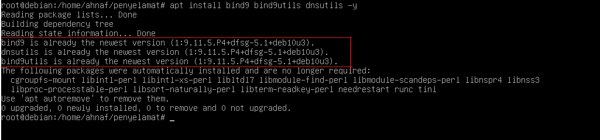  
  2. Lalu nonaktifkan NAT agar Debian tidak mengambil dns dari Internet. Aktifkan jaringan Host-Only Adapter dengan memasang IP Static dan jangan lupa subnetnya. Di /etc/network/**interface**  
  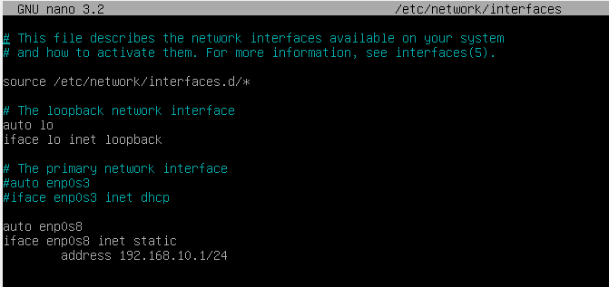  
  3. Jangan lupa untuk restart service networkingnya agar berubah, lalu cek dengan **ip a** untuk melihat apakah sudah sesuai.  
  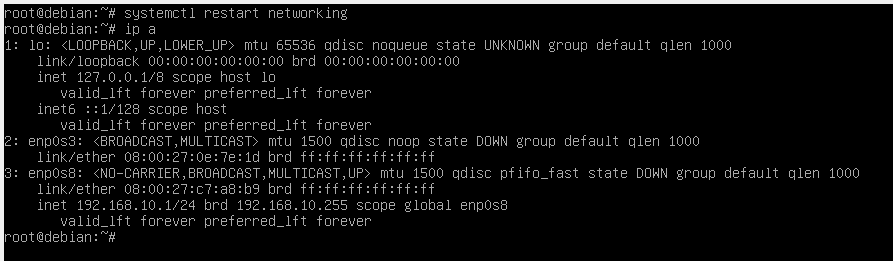  
  4. Selanjutnya kita bisa pergi ke **/etc/bind** dengan **cd /etc/bind**, kita bisa lihat disini ada beberapa file.  
  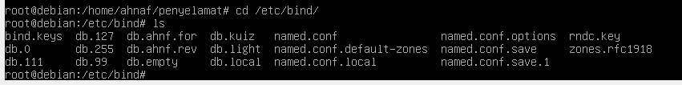  
  5. Copy/duplikat file db.local dan db.127 menjadi file forward dan reverse untuk kita gunakan.  

    cp db.local db.penguin
    cp db.127 db.101
  6. Sekarang konfigurasi file named.conf, buka dengan text editor. Diline paling bawah, beri jarak satu baris dan tambahkan seperti ini.
  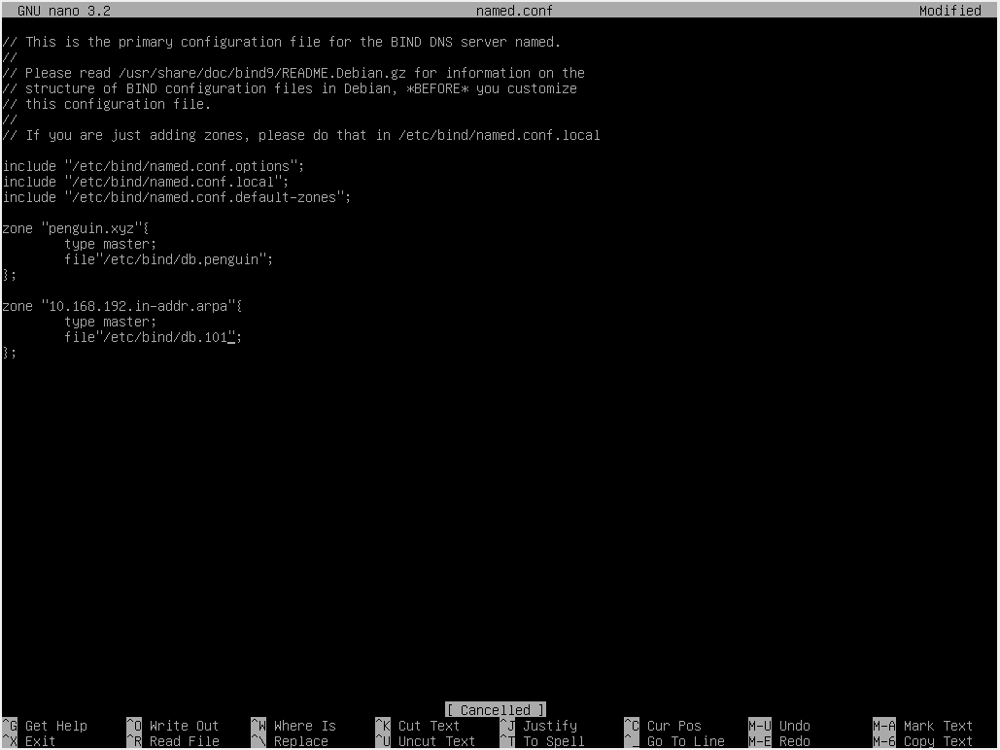  
     Jika sudah save lalu exit dengan **CTRL + X lalu Y dan Enter**.  
     Penjelasan:  
     - **penguin.xyz**, nama domain yang akan kita buat.  
     - **type master**, berarti server ini jadi master DNS (pemilik data utama).  
     - **file**, lokasi file database zona.  
     - **zone "10.168.192.in-addr.arpa"**, nama zona reverse untuk network 192.168.10.0/24. Formatnya selalu dibalik urutan oktet IP + ditambah .in-addr.arpa.  
  7. Selanjutnya konfigurasi file forward zone (db.penguin), buka dengan text editor lalu edit jadi seperti ini.  
  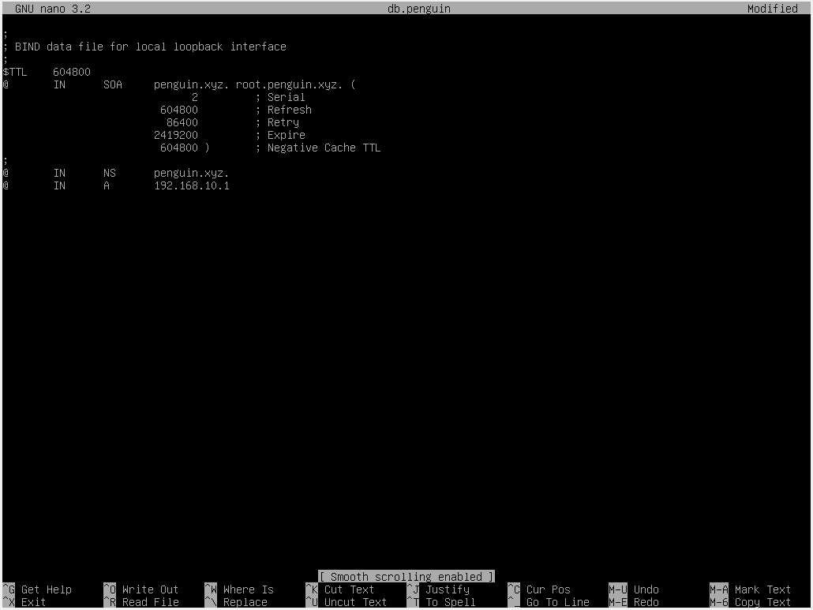
  
     Jika sudah save dan exit.  
     Penjelasan:  
     - Replace semua **localhost** menjadi domain yang kita gunakan (penguin.xyz). Bisa pengunakan CTRL + \, masukan kata yang akan di replace lalu masukan kata penggantinya dan bisa pilih **A** untuk replace all.  
     - Di Line terakhir kita bisa hapus saja karna sekarang hanya mengunakan IPv4, yang line terakhir itu untuk IPv5.  
     - Lalu ganti IP Loopback (127.0.0.1) dengan IP server (192.168.10.1).  
  9. Selanjutnya masuk ke file reverse zone (db.101) lalu edit menjadi seperti ini.  
    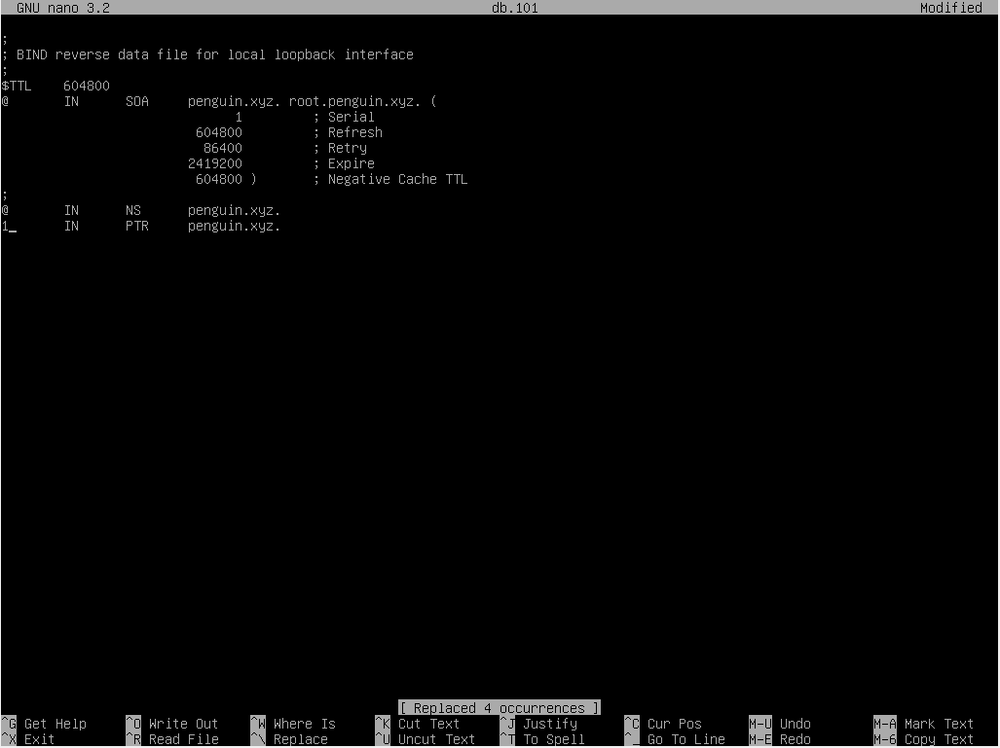  
  
     Jika sudah jangan lupa save lalu exit.  
     Penjelasan:  
     - Replace semua **localhost** menjadi domain yang kita gunakan (penguin.xyz). Bisa pengunakan CTRL + \, masukan kata yang akan di replace lalu masukan kata penggantinya dan bisa pilih **A** untuk replace all.  
     - 1 di line terakhir, isi dengan oktet ke empat. 1 ini Berarti alamat 192.168.10.**1**. Karena zona ini untuk 10.168.192.in-addr.arpa, maka 1 otomatis diterjemahkan jadi 192.168.10.1.  
  10. Selanjutnya edit file resolve.conf di /etc/. File ini dipakai client Linux (bukan server DNS) untuk tau DNS server mana yang harus ditanya kalau ada query. Jadi ini adalah daftar DNS server yang akan dipakai oleh sistem. Buka file resolv dengan text editor (nano). Lalu buat isiannya seperti ini.  
    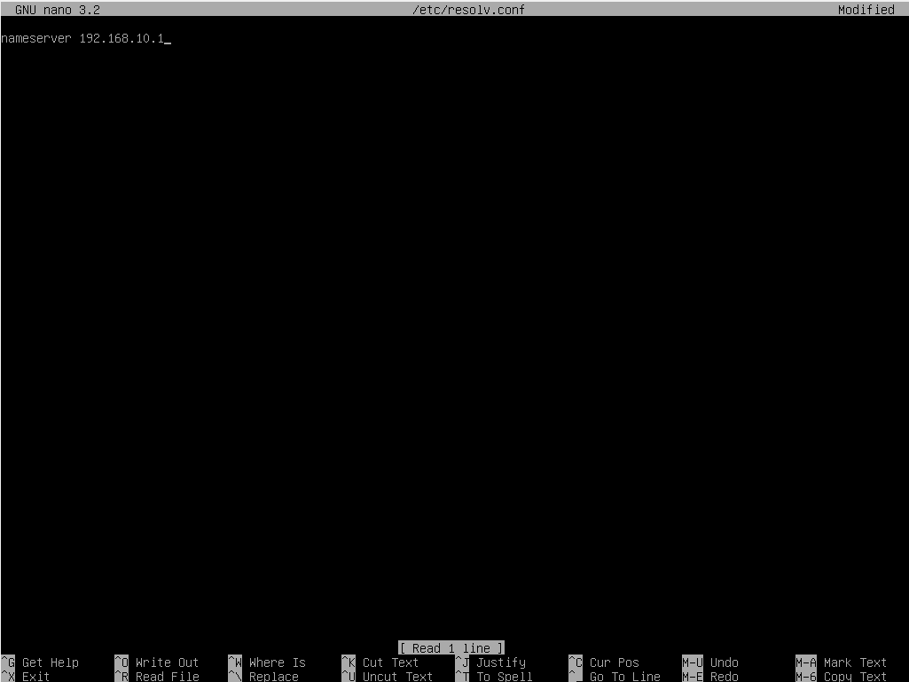  
    Penjelasan:  
    - **nameserver**, keyword untuk mendefinisikan alamat IP server DNS.  
    - **192.168.10.1**, alamat IP server DNS yang akan digunakan.  
  11. Nah sekarang restart Bind9 servicenya. Pastikan restart berhasil, jika gagal akan ada pesan yang muncul disitu.  
    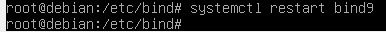  
  12. Jika sudah berhasil sekarang kita ketahap pengujian, kita bisa cek mengunakan **nslookup** dan **dig**. Jika hasil nslookup keluar seperti ini tandanya sudah berhasil.  
    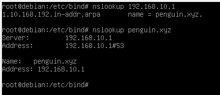  
      Sekarang coba mangunakan **dig**. Jika keluar jawaban IP sesuai record, berarti DNS server sukses jalan.  
    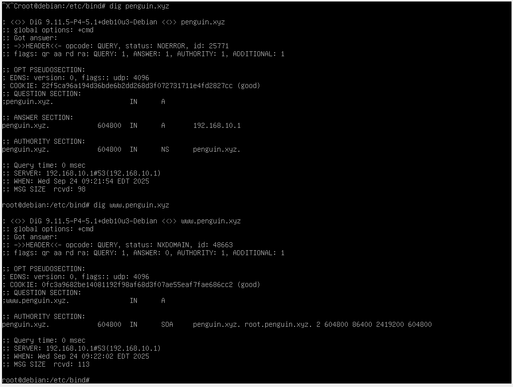  
  13. Sekarang kita coba pengujian di client, pertama kita ubah dulu IP nya agar satu network dengan server. Masuk ke Control panel, adapter host-only, lalu IP, Submask dan DNS secara manual.  
    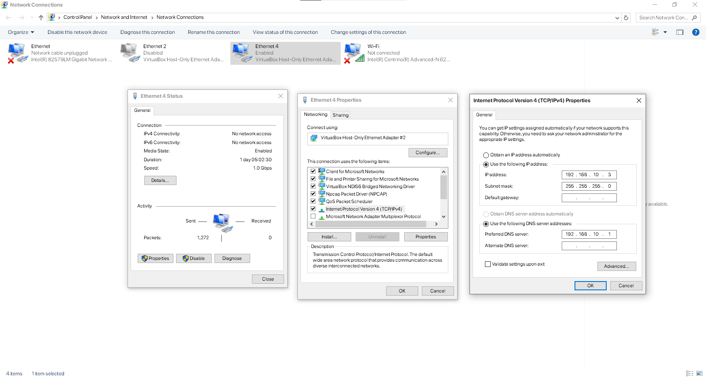  
  14. Sekarang coba buka CMD di client dan ketik **nslookup**. Kalau keluar jawaban domain penguin.xyz dengan IP 192.168.10.1, tandanya server DNS sudah bekerja dengan baik.
    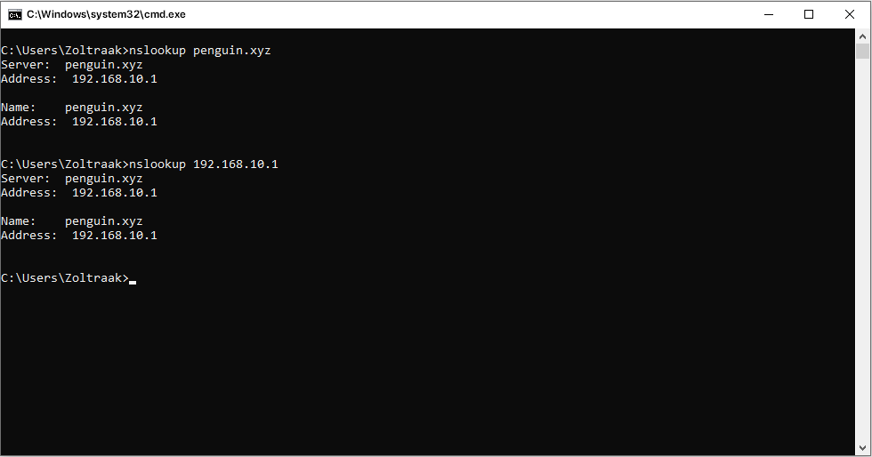  
  
# Pembahasan
  Saat mengonfigurasi DNS server di Debian, sering kali kita sudah merasa semua langkah benar, tapi ternyata pas diuji hasilnya error. Di sini kita akan melihat beberapa error yang paling sering muncul saat mengatur DNS server di Debian beserta penyebab dan cara mengatasinya.  
**1. Service BIND9 gagal start / restart**  
    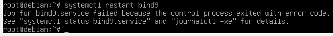  
      Error ini biasanya ada typo di file konfigurasi, untuk mengecek apa yang error kita bisa ketikan **systemctl status bind9** atau **journalctl -xe**. 
    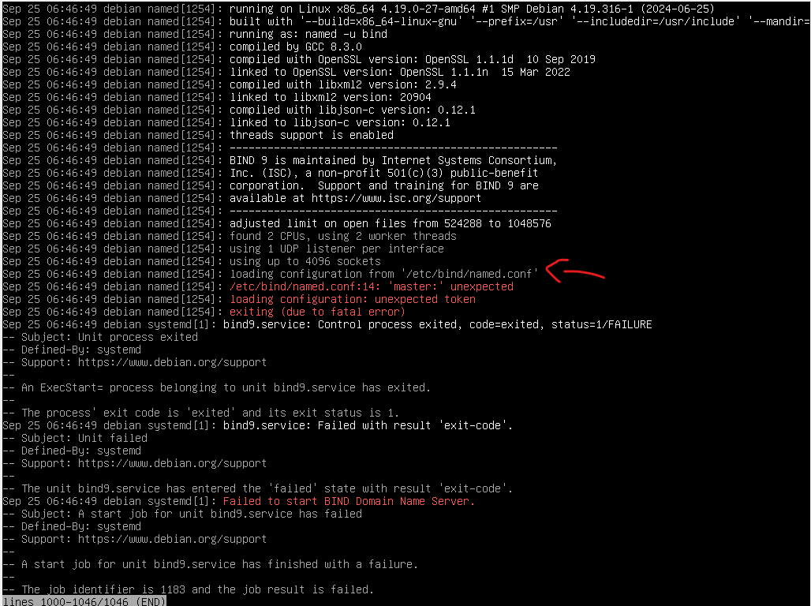  
      Nah kita bisa lihat, katanya errornya dari named.conf di line 14 bagian **master:**. Disini ternyata ada kesalahan penulisan atau typo yang harusnya master; malah master:. Untuk mengatasinya kita hanya perlu pergi ke named.conf lalu edit bagian salahnya, jangan lupa save.  
**2. Server Fail**  
    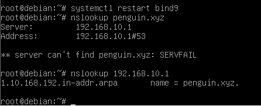  
      Pada gambar diatas, terlihat saat restart baik-baik saja, namjun saat nslookup kedomain server fail, namun ke ip bisa. Nah ini juga biasanya ada kesalahan penulisan, karna ini gagal di domain berarti diantara named.conf dan db.penguin. Untuk mengatasinya cukup periksa file named.conf dan db.penguin, pastikan domainnya dikeduanya cocok. Jika sudah ketemu save dan restart.  

# Kesimpulan
  Konfigurasi DNS server di Debian Buster dengan BIND9 memang membutuhkan perhatian pada detail kecil, mulai dari penulisan file zona, serial number di SOA, hingga pengaturan IP dan nameserver di client. Meski terlihat sederhana, kesalahan sekecil typo atau titik yang lupa bisa membuat server gagal merespon query atau menimbulkan error seperti Server Fail.  
